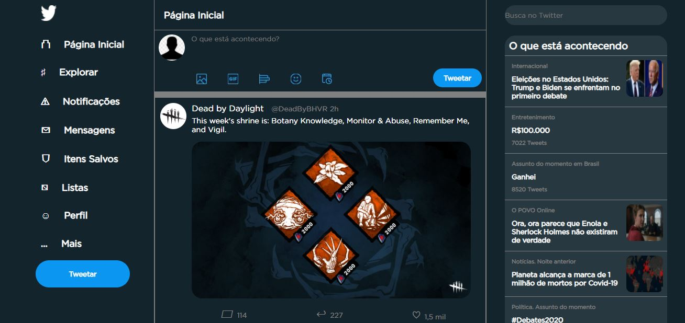
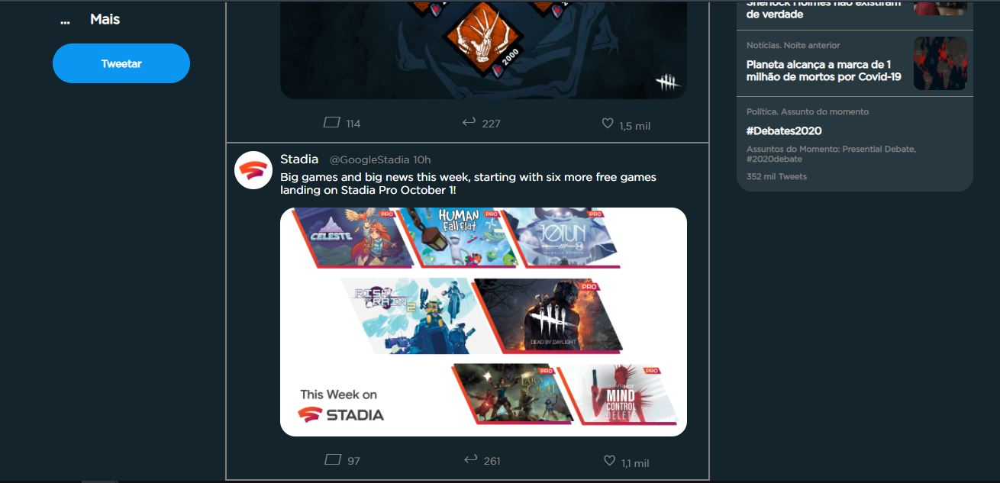

# twitter-clone
Clonando feed do twitter usando apenas CSS e HTML

Inserindo as publicações presentes no meu feed do twitter no momento em que eu estava desenvolvendo.

Descendo mais a página...

Responsividade similiar à do site original.

Para acessar a aplicação, acesse
https://gustas01.github.io/twitter-clone/
